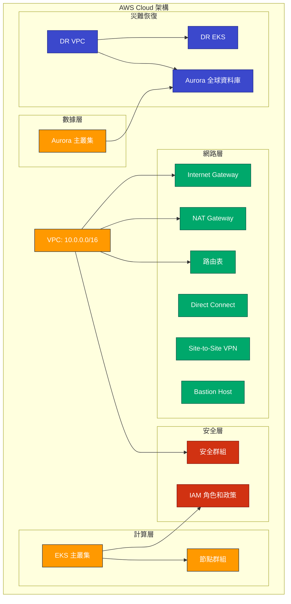

# MyAwesomeAirline 基礎設施即代碼 (IaC) 設計文件

## 目錄
1. [架構概述](#架構概述)
2. [CDK 專案結構](#CDK專案結構)
3. [網路基礎設施](#網路基礎設施)
4. [安全基礎設施](#安全基礎設施)
5. [EKS 叢集](#EKS叢集)
6. [Aurora 數據庫](#Aurora數據庫)
7. [網路連接](#網路連接)
8. [災難恢復基礎設施](#災難恢復基礎設施)
9. [部署流程](#部署流程)
10. [驗證與測試](#驗證與測試)

## 架構概述

本文檔描述了使用 AWS CDK 實施 MyAwesomeAirline 混合雲基礎設施的設計。架構包含以下主要元件：



## CDK專案結構

使用模塊化方法組織 CDK 代碼，每個基礎設施組件有專門的構造和堆疊：

```
myawesome-airline-cdk/
├── lib/
│   ├── myawesome-airline-cdk-stack.ts       # 主堆疊
│   ├── network/                             # 網路相關構造
│   │   ├── vpc-stack.ts                     # VPC、子網等
│   │   └── connection-stack.ts              # Direct Connect、VPN等
│   ├── security/                            # 安全相關構造 
│   │   ├── security-group-stack.ts          # 安全群組
│   │   └── iam-stack.ts                     # IAM 角色和政策
│   ├── compute/                             # 計算相關構造
│   │   └── eks-stack.ts                     # EKS叢集和節點群組
│   ├── database/                            # 資料庫相關構造
│   │   └── aurora-stack.ts                  # Aurora 叢集
│   └── dr/                                  # 災難恢復相關構造
│       └── dr-stack.ts                      # DR VPC、Aurora全球資料庫等
└── bin/
    └── myawesome-airline-cdk.ts             # 入口點
```

以下是所需安裝的 AWS CDK 模組：
- aws-cdk-lib
- @aws-cdk/aws-ec2
- @aws-cdk/aws-eks
- @aws-cdk/aws-rds
- @aws-cdk/aws-iam
- @aws-cdk/aws-directconnect
- @aws-cdk/aws-route53

## 網路基礎設施

### VPC 和子網配置

- **VPC CIDR**: 10.0.0.0/16
- **可用區**: 使用 3 個可用區以確保高可用性
- **子網類型**:
  - 公有子網：用於 Internet Gateway、Load Balancer、Bastion Host
  - 私有子網（帶出口）：用於 EKS 節點、應用程序等需要訪問網際網路的資源
  - 隔離子網：用於 Aurora 數據庫等不需要訪問網際網路的資源

### 網路元件

- **Internet Gateway**: 啟用公有子網與網際網路的通信
- **NAT Gateway**: 每個可用區設置一個，確保私有子網資源能夠訪問網際網路
- **路由表**:
  - 公有子網路由表：直接路由到 Internet Gateway
  - 私有子網路由表：通過 NAT Gateway 路由到外部網際網路
  - 隔離子網路由表：不包含通往網際網路的路由

### 設計注意事項

- 使用子網標籤以便於 EKS 和 Aurora 自動發現
- 為 S3 配置 VPC 端點，減少數據傳出費用
- 子網預留足夠的 IP 地址空間，以應對未來擴展

## 安全基礎設施

### 安全群組

- **Bastion Host 安全群組**:
  - 允許從企業 IP 範圍通過 SSH (TCP 22) 訪問
  - 允許所有出站流量

- **EKS 安全群組**:
  - 允許節點間的所有流量，確保叢集內部通信
  - 允許從 Bastion Host 訪問 EKS API 端點 (TCP 443)
  - 允許所有出站流量

- **資料庫安全群組**:
  - 只允許從 EKS 節點訪問 PostgreSQL 端口 (TCP 5432)
  - 限制出站流量

### IAM 角色和政策

- **EKS 服務角色**:
  - 包含 AmazonEKSClusterPolicy 策略
  - 允許 EKS 服務代表用戶創建和管理資源

- **EKS 節點角色**:
  - 包含 AmazonEKSWorkerNodePolicy
  - 包含 AmazonEKS_CNI_Policy
  - 包含 AmazonEC2ContainerRegistryReadOnly
  - 允許節點加入集群和拉取容器鏡像

- **Bastion Host 角色**:
  - 包含 AmazonSSMManagedInstanceCore
  - 允許通過 AWS Systems Manager 連接到實例
  - 自定義策略允許描述和列出 EKS 叢集

### 設計注意事項

- 遵循最小權限原則，僅授予必要的權限
- 使用 AWS 托管策略搭配自定義策略
- 考慮使用 AWS SecurityHub 進行安全合規監控

## EKS 叢集

### EKS 控制平面

- **Kubernetes 版本**: 1.24
- **端點訪問**: 私有端點訪問，增強安全性
- **密鑰加密**: 使用 KMS 加密 Kubernetes Secrets
- **控制平面日誌**: 啟用審計日誌、API 日誌和身份驗證日誌

### 節點群組

- **實例類型**: m5.large, m5a.large (多樣化實例類型提高可用性)
- **規模**: 最小 2 節點，最大 10 節點，初始 3 節點
- **自動擴展**: 基於 CPU 和內存利用率自動擴展
- **節點位置**: 部署在私有子網
- **系統管理**: 配置 SSM 權限用於遠程訪問節點

### 設計注意事項

- 考慮使用托管節點組簡化管理
- 規劃合理的自動擴展策略
- 考慮使用節點污點隔離關鍵工作負載

## Aurora 數據庫

### Aurora 叢集

- **引擎類型**: Aurora PostgreSQL 13.7
- **實例類型**: r5.large (記憶體優化實例)
- **節點數量**: 3 個實例 (1 個寫入器 + 2 個讀取器)
- **部署位置**: 隔離子網，不直接暴露到網際網路
- **加密**: 存儲加密

### 配置設置

- **參數組**:
  - shared_buffers: 4096MB
  - max_connections: 1000
  - ssl: 啟用
  - log_statement: DDL 記錄

### 備份和恢復

- **備份保留期**: 14 天
- **備份窗口**: 02:00-03:00
- **刪除保護**: 啟用
- **移除策略**: 創建快照後刪除

### 設計注意事項

- 通過密碼輪換提高安全性
- 考慮使用 Performance Insights 監控數據庫性能
- 將常用查詢參數化減少資源消耗

## 網路連接

### Direct Connect

- **連接數量**: 2條物理連接，確保冗餘
- **虛擬介面**: 私有虛擬介面，用於直接訪問 VPC
- **BGP 設定**: 使用私有 ASN
- **MTU**: 配置巨型幀 (9001 MTU) 提高傳輸效率

### Site-to-Site VPN

- **VPN 連接**: 雙線 VPN 連接作為 Direct Connect 的備援
- **客戶閘道**: 配置企業端路由器
- **路由**: BGP 動態路由，自動故障切換

### Bastion Host

- **位置**: 部署在公有子網
- **訪問方式**: 
  - SSH 密鑰認證
  - Systems Manager Session Manager
- **IP 限制**: 僅允許企業網絡的 IP 地址訪問

### 設計注意事項

- 規劃 Direct Connect 和 VPN 的故障轉移策略
- 考慮使用 AWS Transit Gateway 簡化複雜網絡架構
- 實現路由監控和告警

## 災難恢復基礎設施

### 災難恢復 VPC

- **區域**: 次要 AWS 區域 (與主要區域保持地理距離)
- **配置**: 與主 VPC 類似的配置
- **連接**: VPC 對等連接或 Transit Gateway

### Aurora 全球資料庫

- **次要區域**: 在次要區域部署 Aurora 叢集
- **複製**: 使用 Aurora 全球資料庫進行跨區域複製
- **RTO/RPO**: 近乎 0 的 RPO、分鐘級 RTO

### 災難恢復 EKS

- **次要 EKS**: 在次要區域部署 EKS 叢集
- **容器映像**: 確保容器映像在多區域可用
- **狀態同步**: 通過全球資料庫同步狀態

### 設計注意事項

- 定期測試災難恢復計劃
- 自動化災難恢復流程
- 監控複製延遲

## 部署流程

### 部署階段

1. **網路基礎設施**:
   - 部署 VPC、子網、IGW、NAT Gateway
   - 配置路由表和安全組

2. **安全基礎設施**:
   - 創建 IAM 角色和政策
   - 配置 KMS 密鑰

3. **計算和數據層**:
   - 部署 EKS 叢集和節點群組
   - 設置 Aurora 資料庫叢集

4. **網路連接**:
   - 配置 Direct Connect 和 VPN
   - 設置 Bastion Host

5. **災難恢復**:
   - 設置次要區域 VPC
   - 配置 Aurora 全球資料庫
   - 部署災難恢復 EKS 叢集

### 自動化策略

- 使用 AWS CDK 管道自動部署
- 使用 AWS CodePipeline 實現 CI/CD
- 環境差異化配置

## 驗證與測試

### 測試計劃

- **連接性測試**: 確認網絡路徑和安全組設置
- **負載測試**: 驗證 EKS 和 Aurora 的自動擴展
- **故障注入**: 模擬各種故障場景
- **災難恢復測試**: 驗證跨區域故障轉移

### 監控和可觀察性

- **CloudWatch**: 用於基礎設施監控
- **Container Insights**: 監控 EKS 叢集性能
- **RDS 增強監控**: 深入監控 Aurora 實例
- **X-Ray**: 進行分佈式追踪
