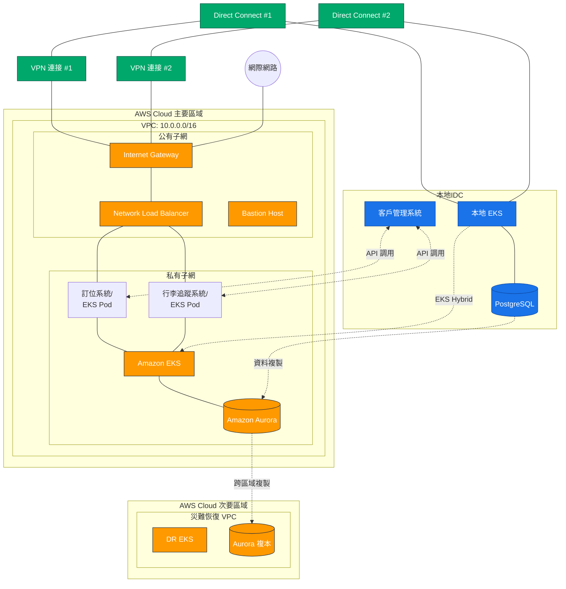

# MyAwesomeAirline 混合雲架構設計

## 混合雲架構圖

## 架構說明

本混合雲架構為 MyAwesomeAirline 設計，主要將訂位系統和行李追蹤系統遷移至 AWS 雲端，同時保留客戶管理系統在地端 IDC。

### 核心元件

#### 本地 IDC 環境
- **客戶管理系統**: 核心業務系統，保留在本地
- **本地 EKS**: EKS Anywhere/EKS Distro 部署在本地環境
- **PostgreSQL**: 本地數據庫，存儲客戶管理數據

#### AWS 雲端環境
- **Amazon EKS**: 管理訂位系統和行李追蹤系統的容器
- **Amazon Aurora**: 高性能關聯式數據庫，用於雲端數據存儲
- **VPC 架構**:
  - CIDR: 10.0.0.0/16
  - 公有子網: 用於 Internet Gateway、Load Balancer
  - 私有子網: 用於應用程序和數據層

#### 網路連接
- **雙線路 Direct Connect**: 提供從本地 IDC 到 AWS 的專用、低延遲連接
- **Site-to-site VPN (雙線)**: 作為 Direct Connect 的備援路徑
- **跨區域連接**: 連接主要和次要 AWS 區域，實現災難恢復

### 數據流
1. 雲端訂位系統和行李追蹤系統通過 API 與本地客戶管理系統交互
2. 本地 PostgreSQL 數據複製到 Amazon Aurora
3. Amazon Aurora 跨區域複製到次要區域，確保災難恢復能力

### 關鍵特性
- **延遲控制**: 架構設計確保數據延遲控制在 30ms 以內
- **高可用性**: 使用多可用區部署和災難恢復區域
- **安全連接**: 使用 Direct Connect 和加密的 VPN 連接
- **容器架構**: 使用 EKS 提供一致的容器環境

### 可擴展性和彈性
- EKS 支持自動擴展，應對流量波動
- Aurora 自動擴展存儲，確保數據增長需求
- 混合雲架構允許工作負載在雲端和本地之間靈活遷移

## 補充說明: AWS 服務標誌

在正式的架構文檔中，建議使用 AWS Architecture Icons 來替換圖中的文本標籤，以提供更專業的視覺效果。AWS 提供官方的架構圖示，可在此下載：[AWS Architecture Icons](https://aws.amazon.com/architecture/icons/)。
